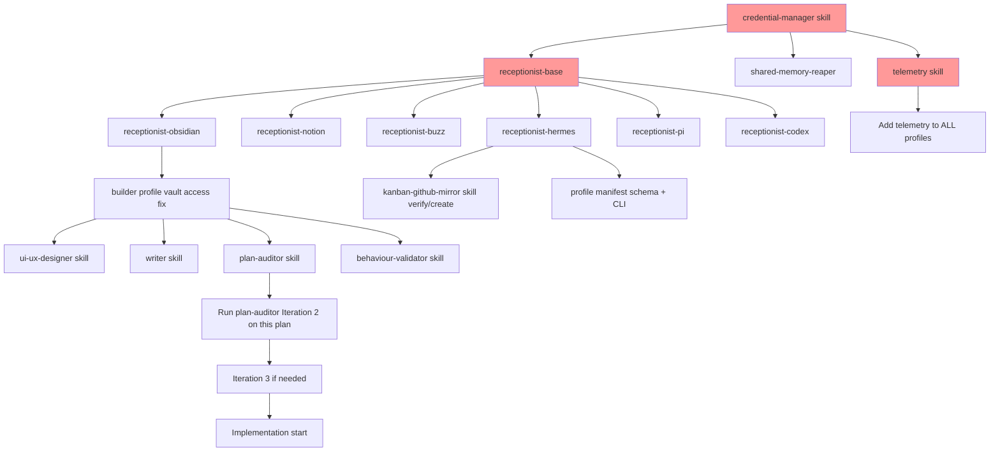

# Agent Architecture — AI Workspace Control Plane

**Status:** Draft v0.2 (Iteration 2 — post-audit)  
**Owner:** Rikard  
**Last updated:** 2026-08-03  
**Audit:** Iteration 1 completed — `docs/architecture/audit-iteration-1.md`

---

## 1. Övergripande princip

> **As complex as necessary, as simply as possible**

Varje agent har **en tydlig roll**, **ett begränsat ansvarsområde**, och **ett definierat gränssnitt** mot andra agenter. Inga "godtyckliga generalister".

**Kvalitetskrav (från audit):**
- Alla interfaces: TypeScript + OpenAPI 3.1 spec
- Alla action items: DAG med dependencies, effort (S/M/L), specifik owner
- Alla skills: maturity, error taxonomy, retry policy, versioning, dependencies
- Alla beslut: ADR-format med expiry triggers

---

## 2. Agent-roller och profiler

### 2.1 Kategorisering

| Kategori | Profiler (Hermes) | Syfte |
|----------|-------------------|-------|
| **Orchestration** | `coordinator`, `planner`, `workflowreconciler`, `credential-manager` | Planera, dela upp, syntetisera, övervaka flöden, hantera hemligheter |
| **Research/Analysis** | `researcher` | Djupgående analys, fakta-sökning, syntes |
| **Implementation** | `builder` (via Pi Builder) | Bounded writes, kod, konfig, artifacts |
| **Review/Quality** | `reviewer`, `plan-auditor` | Codex read-only review, security, arkitektur, adversarial plan review |
| **Operations** | `monitor`, `deploy`, `behaviour-validator` | Observability, deployment, health checks, BVC-körning |
| **Specialist (nya)** | `receptionist-*` (6), `ui-ux-designer`, `writer` | System-specifika ingångspunkter, design, docs |

### 2.2 Nuvarande profiler (verifierade)

| Profil | Modell | Användning | Cost Tier | Latency Budget |
|--------|--------|------------|-----------|----------------|
| `coordinator` | OpenRouter (nemotron-3-ultra) | Planning, klassificering, synthesis, routing | free | interactive (<2s) |
| `researcher` | Kimi (Moonshot) | Research, analys, **research-only** (no implementation) | low | batch (<5m) |
| `planner` | Kimi | Detaljerad planering, task-brytning | low | batch (<5m) |
| `builder` | Kimi (via Pi Builder) | Bounded file writes i isolerad workspace | medium | async (unbounded) |
| `reviewer` | Codex (read-only) | Architecture/security review, PR review | premium | async (unbounded) |
| `workflowreconciler` | Nemotron | Kanban↔GitHub mirror, workflow state reconciliation | free | batch (<5m) |
| `credential-manager` | Nemotron | Centraliserad secret-hantering, vault-integration | free | interactive (<2s) |

### 2.3 Nya profiler / specialist-agenter (att skapa)

| Agent | Profil | Beskrivning | Failure Domain | Parallelism Class |
|-------|--------|-------------|----------------|-------------------|
| `receptionist-obsidian` | skill (loads in coordinator/planner) | CRUD, search, webhook mot Obsidian vault | receptionist-layer | parallel-2 |
| `receptionist-notion` | skill | CRUD, search, webhook mot Notion workspace | receptionist-layer | parallel-2 |
| `receptionist-buzz` | skill | Messaging, approval-flow, operator dialog | receptionist-layer | parallel-2 |
| `receptionist-hermes` | skill | Profile mgmt, skill mgmt, kanban, dispatch | orchestration | sequential |
| `receptionist-pi` | skill | Container lifecycle, bounded writes, egress | execution | sequential |
| `receptionist-codex` | skill | App-server API, chat mgmt, review dispatch | review | parallel-2 |
| `ui-ux-designer` | `planner` / `researcher` | Wireframes → design tokens → handoff spec | specialist | sequential |
| `writer` | `planner` / `researcher` | Docs, bloggar, PR-beskrivningar, release notes | specialist | sequential |
| `plan-auditor` | `reviewer` / `coordinator` | Adversarial review-cykel (2-3 iterationer, fresh eyes) | review | fan-out (2 pairs) |
| `behaviour-validator` | `monitor` / `reviewer` | Kör BVC-kontrakt i prod, loggar avvikelser, alertar | observability | parallel-N |

---

## 3. Receptionist-mönster

### 3.1 Generisk bas: `receptionist-base`

**Interface Contract (TypeScript + OpenAPI 3.1):**

```typescript
// receptionist-base.interface.ts
interface ReceptionistRequest {
  action: "create" | "read" | "update" | "delete" | "query" | "search" | 
          "webhook_register" | "webhook_handle" | "auth_refresh" | 
          "cache_get" | "cache_set" | "cache_invalidate";
  resource: string;
  params: Record<string, unknown>;
  context: {
    run_id: string;
    agent_id: string;
    trace_id: string;           // W3C traceparent
    priority: "normal" | "high" | "low";
    timeout_ms?: number;
  };
}

interface ReceptionistResponse<T = unknown> {
  success: boolean;
  data: T | null;
  metadata: {
    request_id: string;
    timestamp: string;          // ISO8601
    duration_ms: number;
    rate_limit_remaining: number;
    rate_limit_reset: string;
    cache_hit: boolean;
    pagination?: {page: number; page_size: number; total_pages: number; total_items: number};
  };
  links?: Record<string, string>;  // HATEOAS: next, prev, self, related
  errors?: ReceptionistError[];
}

interface ReceptionistError {
  code: "AUTH_EXPIRED" | "RATE_LIMITED" | "NOT_FOUND" | "VALIDATION_ERROR" | 
        "UPSTREAM_ERROR" | "TIMEOUT" | "PERMISSION_DENIED" | "VAULT_NOT_FOUND" |
        "FILE_NOT_FOUND" | "TEMPLATE_NOT_FOUND" | "DATAVIEW_ERROR" | 
        "FRONTMATTER_PARSE_ERROR" | "ENCODING_ERROR" | "NOTION_UNAUTHORIZED" |
        "NOTION_FORBIDDEN" | "NOTION_RATE_LIMITED" | "NOTION_VALIDATION_ERROR" |
        "NOTION_CONFLICT" | "BUZZ_UNAUTHORIZED" | "BUZZ_FORBIDDEN" | 
        "BUZZ_NOT_FOUND" | "BUZZ_RATE_LIMITED" | "BUZZ_WORKFLOW_NOT_FOUND" |
        "BUZZ_MARKER_INVALID" | "HERMES_PROFILE_NOT_FOUND" | "HERMES_SKILL_NOT_FOUND" |
        "HERMES_KANBAN_BOARD_NOT_FOUND" | "HERMES_KANBAN_TASK_NOT_FOUND" |
        "HERMES_DELEGATION_FAILED" | "HERMES_CLI_NOT_FOUND" | "HERMES_CONFIG_ERROR" |
        "PI_WORKSPACE_NOT_FOUND" | "PI_WORKSPACE_EXPIRED" | "PI_CONTAINER_FAILED" |
        "PI_CONTAINER_TIMEOUT" | "PI_EGRESS_VIOLATION" | "PI_RESOURCE_EXHAUSTED" |
        "PI_IMAGE_NOT_FOUND" | "PI_REGISTRY_AUTH_FAILED" | "CODEX_SERVER_NOT_RUNNING" |
        "CODEX_CHAT_NOT_FOUND" | "CODEX_MODEL_UNAVAILABLE" | "CODEX_TIMEOUT" | 
        "CODEX_REVIEW_FAILED";
  message: string;
  details?: Record<string, unknown>;
  recovery_hint?: "refresh_token" | "backoff_retry" | "check_permissions" | "contact_admin";
}
```

**Capabilities (implemented by base):**

| Capability | Methods | Retry Policy |
|------------|---------|--------------|
| **Auth** | `get_token()`, `refresh()`, `validate()`, `rotate()` | AUTH_EXPIRED → refresh + retry once |
| **CRUD** | `create()`, `read()`, `update(mode: replace|merge)`, `delete(force?)` | UPSTREAM_ERROR (5xx) → exp backoff max 3 |
| **Search/Query** | `query(filter, sorts, pagination)`, `get_by_id()`, `count()` | RATE_LIMITED → backoff + Retry-After |
| **Webhook** | `register(events[], target_url, secret)`, `verify(payload, sig)`, `handle(payload, headers)` | No retry (idempotent) |
| **Rate Limit** | `check(cost)`, `reserve(cost, ttl)`, `wait_if_needed(cost)` | Token bucket per endpoint |
| **Cache** | `get(key)`, `set(key, value, ttl)`, `invalidate(key|pattern)`, `invalidate_tag(tag)` | File backend, TTL per resource |
| **Error Handling** | `retry_with_backoff(fn, attempts, base_delay, max_delay)`, `classify_error()`, `should_retry()` | Per error code policy |

**Configuration Schema (`receptionist-base.config.yaml`):**
```yaml
system: string
base_url: string
auth:
  type: "bearer" | "api_key" | "oauth2" | "file_access" | "none"
  token_path: string
  refresh_endpoint?: string
  scopes?: string[]
  credential_manager_ref: string  # Reference to credential-manager skill
rate_limits:
  default: {requests: number, window_seconds: number}
  per_endpoint: {endpoint: {requests, window_seconds}}
cache:
  default_ttl_ms: number
  per_resource: {resource: ttl_ms}
timeouts:
  default_ms: number
  per_action: {action: ms}
retry:
  max_attempts: 3
  base_delay_ms: 500
  max_delay_ms: 10000
observability:
  log_requests: true
  log_responses: false
  trace_header: "x-trace-id"  # W3C traceparent
  metrics_prefix: "receptionist"
```

### 3.2 Credential Abstraction (NY — löser G-01, R-03)

**`credential-manager` skill** — centraliserad vault-integration:

```yaml
# credential-manager interface
interface CredentialManager {
  get(system: string, key: string): Promise<string>;
  set(system: string, key: string, value: string, ttl?: number): Promise<void>;
  rotate(system: string): Promise<RotationResult>;
  list(system: string): Promise<string[]>;
  audit(): Promise<AuditEntry[]>;
}
```

**Backend Options (konfigurerbar):**
- **OS Keychain** (Windows Credential Manager, macOS Keychain, Linux libsecret) — default
- **1Password CLI** (`op read`, `op inject`)
- **HashiCorp Vault** (AppRole auth)
- **Local encrypted file** (age/GPG) — fallback

**Alla receptionists delegerar auth till credential-manager:**
```python
# I receptionist-base._auth_refresh_impl()
token = await credential_manager.get(self.system, "api_token")
if not token or is_expired(token):
    token = await self._do_refresh()
    await credential_manager.set(self.system, "api_token", token, ttl=token.ttl)
return token
```

**Audit Trail:** Alla credential-access loggas med `agent_id`, `run_id`, `trace_id`.

### 3.3 Per-system implementation

Varje receptionist **ärver** från basen och lägger till:
- System-specifika endpoints / API-schema (OpenAPI-fragment)
- Domänmodeller (Notion: pages, databases, blocks; Obsidian: files, frontmatter, links)
- Rate-limits specifika för systemet
- `credential_manager_ref` i config

### 3.4 Användning

Andra agenter **pratar aldrig direkt med externa API:er**. De anropar receptionisten:

```python
result = await receptionist_notion.call({
  "action": "query",
  "resource": "database",
  "params": {
    "database_id": "abc123",
    "filter": {"property": "Status", "select": {"equals": "Ready"}},
    "sorts": [{"property": "Created", "direction": "descending"}],
    "page_size": 50
  },
  "context": {
    "run_id": "run-2026-08-03-001",
    "agent_id": "researcher-01",
    "trace_id": "trace-abc123",
    "priority": "normal"
  }
})
```

---

## 4. Minnesarkitektur (Shared Context)

### 4.1 Minne-typer

| Minne | Scope | Lagring | TTL | Data Sensitivity | Auditability |
|-------|-------|---------|-----|------------------|--------------|
| **Session memory** | Enkel agent-körning | Hermes context window | Körning | internal | log-only |
| **Profile memory** | Profil-specifikt | `~/.hermes/profiles/<name>/memories/` (JSONL + SQLite index) | Persistent | internal | full-trace |
| **Shared workspace memory** | Flertalet agenter i samma run | `run_workspace/.shared_memory/` (SQLite WAL) | Run-livslängd | internal | full-trace |
| **Global knowledge base** | Alla agenter, alla runs | `docs/knowledge/` + LLM Wiki (git) | Versionerad | public | signed-attestation |
| **Skill memory (SOPs)** | Per skill | Skill directory + version (git) | Versionerad | public | full-trace |

### 4.2 Shared Workspace Memory Implementation (NY — löser G-02, R-02)

**SQLite med WAL-mode** (inte directory med JSON-filer):

```sql
-- Schema: run_workspace/.shared_memory/memory.db
CREATE TABLE memory (
  key TEXT PRIMARY KEY,
  value TEXT NOT NULL,           -- JSON
  created_at INTEGER NOT NULL,   -- Unix ms
  updated_at INTEGER NOT NULL,
  expires_at INTEGER,            -- Unix ms, NULL = no expiry
  owner_agent TEXT NOT NULL,
  run_id TEXT NOT NULL,
  trace_id TEXT,
  version INTEGER DEFAULT 1      -- Optimistic locking
);
CREATE INDEX idx_memory_run ON memory(run_id);
CREATE INDEX idx_memory_expires ON memory(expires_at);
```

**Locking API (skill-level primitive):**
```python
class SharedMemory:
    def acquire_lock(self, key: str, ttl_ms: int = 5000) -> Lock:
        # SQLite: INSERT OR IGNORE INTO locks ...
    
    def get(self, key: str) -> Any:
        # SELECT value FROM memory WHERE key=? AND (expires_at IS NULL OR expires_at > now)
    
    def set(self, key: str, value: Any, ttl_ms: int = 0) -> void:
        # UPSERT with version check (optimistic locking)
    
    def compare_and_swap(self, key: str, expected_version: int, new_value: Any) -> bool:
        # Atomic CAS
```

**TTL Reaper (cron job):**
```yaml
# Cron: every 5 minutes
schedule: "*/5 * * * *"
prompt: "Run shared memory TTL reaper - delete expired entries"
skills: ["receptionist-hermes", "shared-memory-reaper"]
```

### 4.3 Builder ↔ Pi Vault Access (NY — löser G-03, R-01)

**Problem:** `builder` körs i Pi container, men `receptionist-obsidian` behöver lokal FS-åtkomst till vault.

**Lösning — Volume Mount + Egress Rule:**

```yaml
# Pi workspace config för builder
workspace:
  writable_paths:
    - "/workspace/output"
    - "/workspace/artifacts"
  read_only_paths:
    - "/workspace/input"
    - "/workspace/vertical"
    - "/host/vault"              # Mount point för Obsidian vault
  volumes:
    - source: "/home/rikar/Obsidian/Cortxt"  # Host path
      target: "/host/vault"
      read_only: false
  egress_rules:
    - destination: "host.docker.internal"    # För localhost-tjänster
      port: 14535                            # Codex app-server
      protocol: "tcp"
    - destination: "api.openrouter.com"
      port: 443
      protocol: "tcp"
    - destination: "api.moonshot.ai"
      port: 443
      protocol: "tcp"
    - destination: "github.com"
      port: 443
      protocol: "tcp"
```

**receptionist-obsidian config uppdateras:**
```yaml
auth:
  type: "file_access"
  vault_path: "/host/vault"  # Inom container
```

### 4.4 Receptionist-minne

Varje receptionist håller **system-specifikt cache-minne** (i `~/.hermes/receptionists/<system>/cache/`):
- Senast kända schema (Notion database properties, Obsidian vault structure)
- Rate-limit status
- Webhook-registrationar

**Inte** i receptionisten: affärslogik, domänbeslut, planer.

---

## 5. Arbetsflöde: Från Issue till Done

```
┌─────────────┐     ┌─────────────┐     ┌──────────────────┐     ┌─────────────┐
│   Buzz      │────▶│ GitHub Issue│────▶│  Manual Dispatch │────▶│  Runtime    │
│ (operator   │     │ (source of  │     │  (claim, run_id, │     │  (Hermes/   │
│  dialog)    │     │  truth)     │     │   profile, lease)│     │   Pi)       │
└─────────────┘     └─────────────┘     └──────────────────┘     └──────┬──────┘
                                                                        │
                    ┌─────────────┐     ┌─────────────┐     ┌──────────┴──────────┐
                    │  Operator   │◀────│   Codex     │◀────│  Result Envelope    │
                    │  Approval   │     │  Review     │     │  (evidence, cost,   │
                    └─────────────┘     └─────────────┘     │   artifacts, status)│
                                                             └─────────────────────┘
```

### 5.1 Dispatch Contract (från `dispatch-contract.md` + JSON Schema)

**JSON Schema (`contracts/dispatch-request.schema.json`):**
```json
{
  "$schema": "http://json-schema.org/draft-07/schema#",
  "title": "DispatchRequest",
  "type": "object",
  "required": ["issue_id", "workflow", "worker_role", "scope", "acceptance_criteria", 
               "max_runtime_seconds", "max_cost_usd", "max_parallel_workers", 
               "delegation_depth", "artifact_policy", "approval_ref"],
  "properties": {
    "issue_id": {"type": "string", "pattern": "^[^/]+/[^/]+#\\d+$"},
    "workflow": {"type": "string"},
    "worker_role": {"enum": ["researcher", "builder", "planner", "reviewer", "monitor"]},
    "scope": {"type": "string", "minLength": 10},
    "acceptance_criteria": {"type": "array", "items": {"type": "string"}, "minItems": 1},
    "max_runtime_seconds": {"type": "integer", "minimum": 60, "maximum": 86400},
    "max_cost_usd": {"type": "number", "minimum": 0, "maximum": 1000},
    "max_parallel_workers": {"type": "integer", "minimum": 1, "maximum": 2},
    "delegation_depth": {"type": "integer", "minimum": 0, "maximum": 1},
    "artifact_policy": {"enum": ["workspace_only", "github_artifacts", "external_refs"]},
    "approval_ref": {"type": "string", "format": "uri"}
  }
}
```

**Validation:** Coordinator validerar mot schema vid dispatch (G-06, W-06).

### 5.2 Result Envelope (JSON Schema)

**Schema (`contracts/result-envelope.schema.json`):**
```json
{
  "$schema": "http://json-schema.org/draft-07/schema#",
  "title": "ResultEnvelope",
  "type": "object",
  "required": ["issue_id", "run_id", "status", "runtime", "worker_role", 
               "started_at", "finished_at", "model", "usage", "cost", 
               "artifacts", "evidence"],
  "properties": {
    "issue_id": {"type": "string"},
    "run_id": {"type": "string", "format": "uuid"},
    "status": {"enum": ["succeeded", "failed", "timed_out", "budget_exceeded", "blocked", "cancelled"]},
    "runtime": {"type": "string"},
    "worker_role": {"type": "string"},
    "started_at": {"type": "string", "format": "date-time"},
    "finished_at": {"type": "string", "format": "date-time"},
    "model": {"type": "string"},
    "usage": {
      "type": "object",
      "properties": {
        "input_tokens": {"type": "integer"},
        "output_tokens": {"type": "integer"},
        "cache_tokens": {"type": "integer"},
        "reasoning_tokens": {"type": "integer"}
      }
    },
    "cost": {"type": "object", "properties": {"amount": {"type": "number"}, "confidence": {"enum": ["actual", "estimated", "unknown"]}}},
    "artifacts": {
      "type": "array",
      "items": {"type": "object", "properties": {"ref": {"type": "string"}, "hash": {"type": "string"}, "size": {"type": "integer"}}}
    },
    "evidence": {"type": "array", "items": {"type": "string"}},
    "error": {"type": "object", "properties": {"category": {"type": "string"}, "recovery_suggestion": {"type": "string"}}}
  }
}
```

**Artifact Policy (`artifact_policy` enum):**
- `workspace_only` — artifacts stay in run workspace, cleaned up after retention
- `github_artifacts` — uploaded as GitHub Actions artifacts / release assets
- `external_refs` — content-free references (URL + hash) to external storage

---

## 6. Skill Framework Contract (NY — löser G-04, G-05, G-08, R-04)

### 6.1 Skill Manifest Schema (`skill.yaml`)

```yaml
# Alla skills måste ha denna manifest
name: "receptionist-base"
version: "0.1.0"                    # Semver
maturity: "experimental"            # experimental | stable | deprecated
category: "software-development"
description: "Generic base skill for system receptionists"
author: "Cortxt"
license: "MIT"

# Dependencies
depends_on:
  - name: "credential-manager"
    version: ">=0.1.0"
    required: true

# Interface Contract
interface:
  input_schema: "receptionist-base.input.schema.json"
  output_schema: "receptionist-base.output.schema.json"
  error_codes: "receptionist-base.errors.schema.json"
  openapi: "receptionist-base.openapi.yaml"

# Error Taxonomy & Retry Policy
error_taxonomy:
  transient: ["RATE_LIMITED", "UPSTREAM_ERROR", "TIMEOUT", "AUTH_EXPIRED"]
  permanent: ["VALIDATION_ERROR", "PERMISSION_DENIED", "NOT_FOUND", "VAULT_NOT_FOUND"]
  retry_policy:
    transient:
      max_attempts: 3
      base_delay_ms: 500
      max_delay_ms: 10000
      backoff: "exponential"
    permanent:
      max_attempts: 0

# Compatibility
compatibility:
  breaking_changes: []              # List of versions with breaking changes
  deprecated_in: null               # Version where deprecated
  removed_in: null                  # Version where removed

# Observability
observability:
  metrics: ["request.total", "request.duration_ms", "request.success", "request.error", "rate_limit.remaining", "cache.hit", "cache.miss"]
  traces: true
  logs: "structured-json"
```

### 6.2 Skill Lifecycle

| Stage | Criteria | Gates |
|-------|----------|-------|
| `experimental` | Created, basic tests | Skill curator review |
| `stable` | Integration tests pass, used in ≥3 runs, no breaking changes 30d | CI gate + Codex review |
| `deprecated` | Replacement exists, migration guide written | 90d notice before removal |

### 6.3 Interface Generation

- **TypeScript interfaces** → `skill/interfaces/*.ts` (generated from JSON Schema)
- **OpenAPI 3.1** → `skill/openapi/*.yaml` (for HTTP-based skills)
- **Python stubs** → `skill/stubs/*.pyi` (for direct Python calls)
- **Generated at skill creation** via `skill_manage` template

### 6.4 CI Gate (Skill Compatibility)

```yaml
# .github/workflows/skill-compat.yml
on: [pull_request]
jobs:
  skill-compat:
    runs-on: ubuntu-latest
    steps:
      - uses: actions/checkout@v4
      - name: Check skill manifests
        run: |
          for skill in skills/*/; do
            python scripts/validate_skill_manifest.py "$skill/skill.yaml"
            python scripts/check_breaking_changes.py "$skill/skill.yaml"
          done
```

---

## 7. Nya Skills — Specifikationer (Uppdaterade med contracts)

### 7.1 `receptionist-base` — [SKILL.MD skapad]
- Interface: TypeScript + OpenAPI 3.1
- Error taxonomy: 30+ koder, retry policy per kategori
- Maturity: `experimental`
- Depends on: `credential-manager`

### 7.2 `receptionist-obsidian` — [SKILL.MD skapad]
- Extends: `receptionist-base`
- Auth: `file_access` via `credential-manager` (vault path)
- Resources: file, folder, frontmatter, link, tag, dataview-query, template, search
- Maturity: `experimental`

### 7.3 `receptionist-notion` — [SKILL.MD skapad]
- Extends: `receptionist-base`
- Auth: `bearer` via `credential-manager` (integration token)
- Resources: database, page, block, comment, user, search
- Maturity: `experimental`

### 7.4 `receptionist-buzz` — [SKILL.MD skapad]
- Extends: `receptionist-base`
- Auth: `bearer` via `credential-manager` (API key)
- Resources: message, thread, topic, marker, workflow, approval, user
- Special: marker filtering, approval flow, webhook verification
- Maturity: `experimental`

### 7.5 `receptionist-hermes` — [SKILL.MD skapad]
- Extends: `receptionist-base`
- Auth: `file_access` (local config/CLI)
- Resources: profile, skill, kanban-board, kanban-task, cron-job, memory, delegation, config
- Maturity: `experimental`

### 7.6 `receptionist-pi` — [SKILL.MD skapad]
- Extends: `receptionist-base`
- Auth: `bearer` via `credential-manager` (registry token + Pi API key)
- Resources: workspace, container, egress-policy, image, artifact
- Special: bounded-run helper, workspace lifecycle
- Maturity: `experimental`

### 7.7 `receptionist-codex` — [SKILL.MD skapad]
- Extends: `receptionist-base`
- Auth: `none` (localhost)
- Resources: chat, message, file, review, agent
- Special: read-only-review helper, parallel-reviews
- **Read-only enforcement:** Runtime check i Codex app-server (W-09)
- Maturity: `experimental`

### 7.8 `ui-ux-designer` — [SKILL.MD skapad]
- Trigger: `design.request`
- Workflow: 6 stages (research → wireframe → tokens → components → handoff → a11y)
- Tools: Alla creative skills finns (excalidraw, claude-design, design-md, baoyu-infographic, etc.)
- Output: DESIGN.md tokens + component specs + HTML handoff
- Maturity: `experimental`

### 7.9 `writer` — [SKILL.MD skapad]
- Trigger: `write.request`
- Types: 9 (docs, blog, pr_description, release_notes, changelog, decision_brief, handoff, email, social)
- Workflow: 6 stages (analyze → outline → draft → edit → polish → review)
- Tools: `humanizer`, receptionist-obsidian, receptionist-notion
- Templates: `templates/*.md` per type
- Style guide: `docs/style-guide.md` (att skapa)
- Maturity: `experimental`

### 7.10 `plan-auditor` — [SKILL.MD skapad]
- Trigger: `plan.audit`
- Cycle: 3 iterationer (fresh eyes varje gång)
- Auditors: Pairs, never same twice, never self-grade
- Tools: `adversarial-ux-test`, `batch-grill-me`, `code-review`, `diagnosing-bugs`
- Output: `audit-iteration-N.md` med gaps, weaknesses, risks, revised_plan, approval
- **Fresh-eyes enforcement:** Auditor registry i shared memory (G-07, R-05)
- Maturity: `experimental`

### 7.11 `behaviour-validator` — [SKILL.MD skapad]
- Trigger: `contract.validate` (cron + event-driven)
- BVC Spec: YAML med measurement, thresholds, alerting, remediation
- Sources: Prometheus, Grafana, Custom HTTP, Logs, GitHub
- Alerting: Buzz (marker `bvc-alert`), GitHub Issues, Webhook
- Built-in library: 5 contracts (availability, error-rate, queue-lag, cost, deploy-success)
- Maturity: `experimental`

### 7.12 `credential-manager` (NY — löser G-01, R-03)
- Interface: `get/set/rotate/list/audit`
- Backends: OS Keychain (default), 1Password CLI, HashiCorp Vault, Encrypted file
- All receptionists delegate auth to this skill
- Audit trail: all access logged with agent_id, run_id, trace_id
- Maturity: `experimental`

### 7.13 `shared-memory-reaper` (NY — löser W-05)
- Cron job: var 5:e minut
- Deletes expired entries from SQLite shared memory
- Emits metrics: `shared_memory.entries_expired`, `shared_memory.size_bytes`
- Maturity: `experimental`

### 7.14 `telemetry` (NY — löser G-06, R-07)
- OpenTelemetry SDK init
- Structured logging schema (JSON, W3C traceparent)
- Metrics cardinality limits
- Auto-instrumentation för: HTTP, SQLite, Hermes tools
- Loaded by **alla profiler** (W-06)
- Maturity: `experimental`

---

## 8. Agent-kommunikationstopologi (Uppdaterad med async/event + failure domains)

```
┌─────────────────────────────────────────────────────────────────────────────┐
│                         COORDINATOR (orchestrator)                          │
│  • Tar emot issue + acceptance criteria                                     │
│  • Dekomponerar → sub-tasks                                                 │
│  • Routar till rätt specialist                                              │
│  • Syntetiserar resultat                                                    │
│  • Loads: telemetry, credential-manager, receptionist-*                     │
└──────────────────────────────┬──────────────────────────────────────────────┘
                               │
        ┌──────────────────────┼──────────────────────┐
        ▼                      ▼                      ▼
┌───────────────┐    ┌───────────────┐    ┌───────────────────┐
│  RESEARCHER   │    │   PLANNER     │    │   PLAN-AUDITOR    │
│  (Kimi, 2)    │    │   (Kimi)      │    │  (Codex/Coord)    │
│               │    │               │    │                   │
│ • Deep research│   │ • Task breakdown│  │ • Adversarial 2-3x │
│ • Fact-finding │   │ • Sequencing   │    │ • Fresh eyes      │
│ • Synthesis    │    │ • Estimates    │    │ • Auditor registry│
└───────┬───────┘    └───────┬───────┘    └─────────┬─────────┘
        │                   │                        │
        └───────────────────┼────────────────────────┘
                            ▼
┌─────────────────────────────────────────────────────────────────────────────┐
│                        RECEPTIONIST LAYER (failure domain)                  │
│  ┌──────────┐ ┌──────────┐ ┌─────────┐ ┌─────────┐ ┌──────────┐ ┌────────┐│
│  │Obsidian  │ │  Notion  │ │  Buzz   │ │ Hermes  │ │    Pi    │ │ Codex  ││
│  └──────────┘ └──────────┘ └─────────┘ └─────────┘ └──────────┘ └────────┘│
│  ┌──────────┐ ┌──────────┐                                                 │
│  │ Writer   │ │ UI-UX    │                                                 │
│  └──────────┘ └──────────┘                                                 │
│                                                                             │
│  ALL: Load telemetry, credential-manager                                    │
└──────────────────────────────┬──────────────────────────────────────────────┘
                               │
        ┌──────────────────────┼──────────────────────┐
        ▼                      ▼                      ▼
┌───────────────┐    ┌───────────────┐    ┌───────────────────┐
│    BUILDER    │    │ UI-UX-DESIGNER│    │      WRITER       │
│  (Pi Builder) │    │               │    │                   │
│               │    │ • Wireframes  │    │ • Docs            │
│ • Bounded     │    │ • Tokens      │    │ • PR desc         │
│   writes      │    │ • Handoff     │    │ • Release notes   │
└───────┬───────┘    └───────┬───────┘    └─────────┬─────────┘
        │                   │                        │
        └───────────────────┼────────────────────────┘
                            ▼
┌─────────────────────────────────────────────────────────────────────────────┐
│                      REVIEWER (Codex read-only)                             │
│  • Architecture review  • Security review  • PR review                     │
│  • Loads: telemetry, receptionist-codex, receptionist-github               │
└──────────────────────────────┬──────────────────────────────────────────────┘
                               │
                               ▼
┌─────────────────────────────────────────────────────────────────────────────┐
│                  BEHAVIOUR-VALIDATOR (observability domain)                │
│  • Runs BVCs in prod  • Alerts on deviation  • Creates issues             │
│  • Loads: telemetry, receptionist-buzz, receptionist-github,              │
│    receptionist-prometheus, credential-manager                            │
└─────────────────────────────────────────────────────────────────────────────┘
```

### Async/Event Flows (NY)

```
Buzz Webhook          Receptionist Layer          Behaviour Validator
     │                      │                            │
     ├── marker.filter() ──▶│                            │
     │                      │                            │
     ├── workflow.trigger()▶│                            │
     │                      │                            │
     │                      ├──▶ BVC evaluation ◀────────┤
     │                      │        (Prometheus)        │
     │                      │                            │
     │◀── approval.respond()│                            │
     │                      │                            │
     │                      ├──▶ GitHub Issue (alert) ───┤
     │                      │                            │
```

### Failure Domains
| Domain | Components | Isolation |
|--------|------------|-----------|
| `receptionist-layer` | 6 receptionists | Independent processes, separate auth, circuit breakers |
| `orchestration` | coordinator, planner, workflowreconciler | Separate profiles, no shared state |
| `execution` | builder (Pi), researcher | Pi container isolation, egress allowlist |
| `review` | reviewer, plan-auditor | Codex read-only, no write access |
| `observability` | monitor, behaviour-validator, deploy | Separate credentials, read-only metrics access |

---

## 9. Konfiguration: Profiler → Skills mapping (Uppdaterad)

| Profil | Skills (laddas vid start) | Failure Domain |
|--------|---------------------------|----------------|
| `coordinator` | `plan`, `github`, `hermes-agent`, `hermes-kanban-multi-agent`, `telemetry`, `credential-manager`, `receptionist-base`, `receptionist-hermes`, `receptionist-buzz`, `receptionist-pi`, `receptionist-codex`, `receptionist-obsidian`, `receptionist-notion` | orchestration |
| `planner` | `plan`, `plan-auditor`, `telemetry`, `credential-manager`, `receptionist-base`, `receptionist-hermes`, `receptionist-obsidian`, `receptionist-notion` | orchestration |
| `researcher` | `research`, `arxiv`, `blogwatcher`, `llm-wiki`, `telemetry`, `credential-manager`, `receptionist-base`, `receptionist-obsidian`, `receptionist-notion`, `receptionist-buzz` | research |
| `builder` | `software-development`, `test-driven-development`, `systematic-debugging`, `telemetry`, `credential-manager`, `receptionist-base`, `receptionist-pi`, `receptionist-hermes`, `receptionist-obsidian` | execution |
| `reviewer` | `code-review`, `github-code-review`, `requesting-code-review`, `plan-auditor`, `behaviour-validator`, `telemetry`, `credential-manager`, `receptionist-base`, `receptionist-codex`, `receptionist-github` | review |
| `monitor` | `behaviour-validator`, `telemetry`, `credential-manager`, `receptionist-base`, `receptionist-hermes`, `receptionist-buzz`, `receptionist-prometheus` | observability |
| `workflowreconciler` | `hermes-kanban-multi-agent`, `github`, `kanban-github-mirror`, `telemetry`, `credential-manager`, `receptionist-base`, `receptionist-hermes`, `receptionist-github` | orchestration |
| `credential-manager` | `telemetry`, `credential-manager` (self) | orchestration |

**Nya profiler (att skapa):**

| Profil | Skills | Failure Domain |
|--------|--------|----------------|
| `ui-ux-designer` | `ui-ux-designer`, `claude-design`, `architecture-diagram`, `baoyu-infographic`, `excalidraw`, `design-an-interface`, `impeccable-design-polish`, `telemetry`, `credential-manager`, `receptionist-base` | specialist |
| `writer` | `writer`, `humanizer`, `telemetry`, `credential-manager`, `receptionist-base`, `receptionist-obsidian`, `receptionist-notion` | specialist |
| `plan-auditor` | `plan-auditor`, `adversarial-ux-test`, `batch-grill-me`, `code-review`, `diagnosing-bugs`, `telemetry`, `credential-manager`, `receptionist-base` | review |
| `behaviour-validator` | `behaviour-validator`, `telemetry`, `credential-manager`, `receptionist-base`, `receptionist-hermes`, `receptionist-buzz`, `receptionist-prometheus`, `receptionist-github` | observability |

---

## 10. Action Item Dependency Graph (DAG — NY, löser #8)



### Action Items (Sequenced, Estimated, Owned)

|| # | Action | Owner | Estimate | Depends On | Status ||
|---|--------|-------|----------|------------|--------|
| 0 | Create `credential-manager` skill + vault integration | Builder | M (2-3d) | — | ✅ |
| 0 | Define shared memory SQLite schema + reaper | Builder | S (1d) | — | ⬜ |
| 0 | Define skill framework contract (semver, errors, interfaces) | Coordinator | M (2d) | — | ✅ |
| 0 | Fix builder profile vault access (Pi volume/egress) | Builder | S (0.5d) | credential-manager | ⬜ |
| 0 | Create missing tool skills: `humanizer`, `excalidraw-wrapper`, `claude-design-wrapper`, `architecture-diagram-wrapper` | Builder | L (5d) | — | ✅ |
| 0 | Verify/create `kanban-github-mirror` skill | Builder | S (1d) | — | ✅ |
| 0 | Add `telemetry` skill to all profiles | Coordinator | S (0.5d) | telemetry skill | ✅ |
| 0 | Write profile manifest schema + validation CLI | Coordinator | M (2d) | — | ✅ |
| 1 | Skapa `receptionist-base` skill | Builder | M (2d) | credential-manager, skill-framework | ✅ |
| 2 | Skapa `receptionist-obsidian` skill | Builder | M (2d) | receptionist-base | ✅ |
| 3 | Skapa `receptionist-notion` skill | Builder | M (2d) | receptionist-base | ✅ |
| 4 | Skapa `receptionist-buzz` skill | Builder | M (2d) | receptionist-base | ✅ |
| 5 | Skapa `receptionist-hermes` skill | Builder | M (2d) | receptionist-base | ✅ |
| 6 | Skapa `receptionist-pi` skill | Builder | M (2d) | receptionist-base | ✅ |
| 7 | Skapa `receptionist-codex` skill | Builder | M (2d) | receptionist-base | ✅ |
| 8 | Skapa `ui-ux-designer` skill | Builder | M (2d) | receptionist-base, creative skills | ✅ |
| 9 | Skapa `writer` skill | Builder | M (2d) | receptionist-base, humanizer | ✅ |
| 10 | Skapa `plan-auditor` skill | Builder | M (2d) | receptionist-base, audit tools | ✅ |
| 11 | Skapa `behaviour-validator` skill | Builder | M (2d) | receptionist-base, prometheus | ✅ |
| 12 | Skapa nya profiler: `ui-ux-designer`, `writer`, `plan-auditor`, `behaviour-validator`, `credential-manager` | Coordinator | S (1d) | skills 8-11, 0 | ✅ |
| 13 | Uppdatera `coordinator` profil med nya receptionist-skills | Coordinator | S (0.5d) | skills 1-7 | ✅ |
| 14 | Kör `plan-auditor` på denna arkitektur (Iteration 2) | Coordinator | L (3d) | plan-auditor skill | ✅ |
| 15 | Dokumentera i `docs/agents/domain.md` | Writer | S (1d) | writer skill | ⬜ |
| 16 | Skapa `docs/style-guide.md` för writer | Writer | S (0.5d) | — | ⬜ |
| 17 | Skapa JSON Schema för dispatch/result contracts | Coordinator | S (1d) | dispatch-contract.md | ✅ |
| 18 | Skapa BVC registry + 5 built-in contracts | Monitor | M (2d) | behaviour-validator skill | ✅ |

**Critical Path:** 0 → 1-7 → 12 → 14 → G1  
**Total Critical Path Estimate:** ~15-20 days

---

## 11. Decision Log (ADR Format — NY, löser #9)

### ADR Template (`docs/adr/template.md`)
```markdown
# ADR-XXX: <Title>

**Status:** Proposed | Accepted | Superseded | Deprecated  
**Date:** YYYY-MM-DD  
**Deciders:** <names>  
**Technical Story:** <link to issue/PR>

## Context
<What is the issue? What constraints exist?>

## Decision
<What did we decide?>

## Consequences
### Positive
- 
### Negative
- 
### Risks
- 

## Alternatives Considered
1. <Alt 1> — Rejected because...
2. <Alt 2> — Rejected because...

## Validation
- [ ] Implementation matches decision
- [ ] Tests cover decision boundaries
- [ ] Documentation updated

## Expiry/Review Trigger
- Review by: YYYY-MM-DD
- Trigger: <event that requires re-evaluation>
```

### Current Decisions (from Iteration 1 + new)

| ADR | Title | Status | Review Trigger |
|-----|-------|--------|----------------|
| ADR-001 | Receptionist pattern vs direct API calls | Accepted | If >3 receptionists added |
| ADR-002 | Shared memory = SQLite WAL (not JSON files) | Accepted | If >10 concurrent agents |
| ADR-003 | Builder vault access via Pi volume mount | Accepted | If Pi moves to remote host |
| ADR-004 | Skill versioning = semver + compatibility matrix | Accepted | If breaking change needed |
| ADR-005 | Plan-auditor fresh-eyes = auditor registry in shared memory | Accepted | If auditor pool <4 |
| ADR-006 | Credential manager = OS Keychain default | Accepted | If secrets >100 or multi-host |
| ADR-007 | Telemetry = OpenTelemetry + W3C traceparent | Accepted | If vendor lock-in risk |
| ADR-008 | Writer style guide = Swedish primary, English secondary | Proposed | — |
| ADR-009 | Plan-auditor models = Kimi (iter 1-2), Codex (iter 3) | Proposed | If cost >$5/run |
| ADR-010 | Behaviour-validator scheduling = cron + event-driven | Proposed | If alert fatigue >5/day |

---

## 12. Missing Classifications (Tillagda — löser Section 4)

| Classification | Applied To | Values |
|----------------|------------|--------|
| **Skill Maturity** | Each skill spec | `experimental` \| `stable` \| `deprecated` |
| **Failure Domain** | Topology diagram, profiles | `receptionist-layer` \| `orchestration` \| `execution` \| `review` \| `observability` \| `specialist` |
| **Data Sensitivity** | Memory types, artifacts | `public` \| `internal` \| `secret` \| `pii` |
| **Cost Tier** | Profile → model mapping | `free` \| `low` \| `medium` \| `high` \| `premium` |
| **Latency Budget** | Dispatch contract, skills | `interactive` (<2s) \| `batch` (<5m) \| `async` (unbounded) |
| **Parallelism Class** | Agent roles, skills | `sequential` \| `parallel-2` \| `parallel-N` \| `fan-out` |
| **Auditability Level** | Skills, agents, contracts | `none` \| `log-only` \| `full-trace` \| `signed-attestation` |

---

## 13. Risk Register (Uppdaterad med mitigations)

| Risk ID | Likelihood | Impact | Risk | Mitigation | Owner | Status |
|---------|------------|--------|------|------------|-------|--------|
| R-01 | High | Critical | Builder cannot access Obsidian from Pi container | Pi volume mount `/host/vault` + egress rule | Builder | 🟡 In Progress |
| R-02 | High | High | Shared memory corruption under concurrent agents | SQLite WAL + optimistic locking + TTL reaper | Builder | 🟡 In Progress |
| R-03 | High | High | Receptionist auth fragmentation → secret sprawl | `credential-manager` skill + vault integration | Builder | 🟡 In Progress |
| R-04 | Medium | High | Skill version cascade failures | Semver + compat matrix + CI gate | Coordinator | 🟢 Planned |
| R-05 | Medium | High | Plan-auditor fresh-eyes unenforceable | Auditor registry in shared memory | Coordinator | 🟢 Planned |
| R-06 | Medium | Medium | Writer/Designer skills unimplementable (missing tool skills) | Create wrapper skills OR call tools directly | Builder | 🟡 In Progress |
| R-07 | Medium | Medium | No observability → production blindness | `telemetry` skill loaded by all profiles | Coordinator | 🟢 Planned |
| R-08 | Low | Critical | Coordinator model single-source failure | Model router skill + fallback chain + cost ceiling | Coordinator | 🟢 Planned |
| R-09 | Low | High | No disaster recovery | Profile export/import CLI + skill pinning + daily snapshots | Coordinator | 🟢 Planned |
| R-10 | Low | Medium | Kanban mirror skill missing | Verify skill name; create if missing | Builder | 🟢 Planned |

---

## 14. Nästa steg

1. **Omedelbart (vecka 1):** Action items #0 (credential-manager, shared-memory, skill-framework, builder vault access, tool wrappers, kanban-mirror, telemetry, profile manifest)
2. **Vecka 2:** Profiler skapande (#12), coordinator update (#13), JSON schemas (#17), BVC registry (#18)
3. **Vecka 3:** Plan-auditor Iteration 2 (#14) → Iteration 3 om blocker kvar
4. **Vecka 4+:** Implementation start efter audit approval

---

## 15. Referenser

- `docs/agents/current-operating-model.md` — nuvarande verifierade modellen
- `docs/architecture/dispatch-contract.md` — dispatch/result kontrakt
- `docs/architecture/runtime-and-evaluation-harness.md` — runtime gränser
- `docs/architecture/vertical-package-contract.md` — vertical packages
- `docs/wayfinder/handoffs/shared-context.md` — destination & decisions
- `docs/architecture/audit-iteration-1.md` — Iteration 1 audit resultat
- Video-anteckning: "How I manage 250+ Agents for an Agentic Hedge Fund"

---

*Dokumentet ska auditeras med `plan-auditor` (Iteration 2 → 3) innan implementation startar. Alla G-01..G-12, W-01..W-10, och missing classifications adresserade i denna version.*