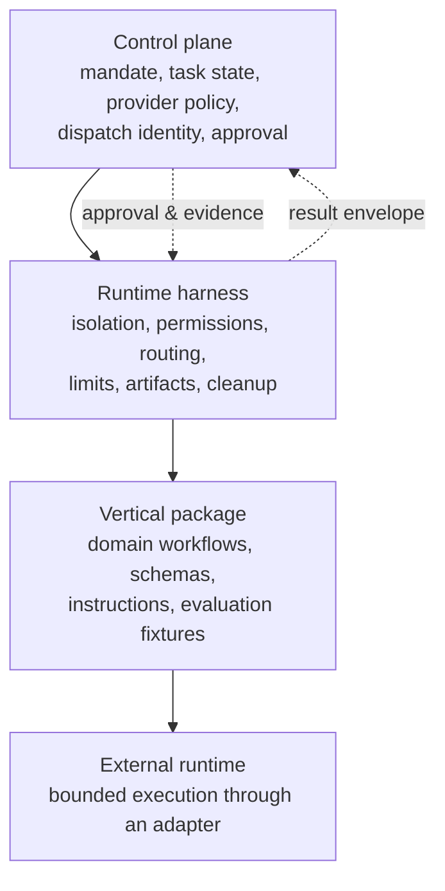

Cortxt separates durable authority from replaceable execution. The control plane owns scope, policy, identity, evidence, and approval contracts. External models, providers, and agent runtimes supply execution capacity behind adapters.

## Core boundaries

| Layer | Owns | Does not own |
| --- | --- | --- |
| Control plane | Mandate, task state, provider policy, dispatch identity, approval | Domain answers or runtime-specific behavior |
| Runtime harness | Isolation, permissions, routing, limits, artifacts, cleanup | Domain rules or final human approval |
| Vertical package | Domain workflows, schemas, instructions, evaluation fixtures | Dispatch, credentials, sandbox policy, global approval |
| External runtime | Bounded execution through an adapter | Product authority or durable workflow state |

## Read the contracts

- [Dispatch contract](/docs/architecture/dispatch-contract/) defines request identity, lifecycle, state transitions, and terminal evidence.
- [Runtime and evaluation harness](/docs/architecture/runtime-evaluation/) defines the domain-neutral execution boundary.
- [Vertical package contract](/docs/architecture/vertical-packages/) keeps domain behavior separate from platform infrastructure.

Architecture authority comes from [Accepted ADRs](/docs/adrs/). Proposed ADRs are reviewable designs, not Accepted decisions.
