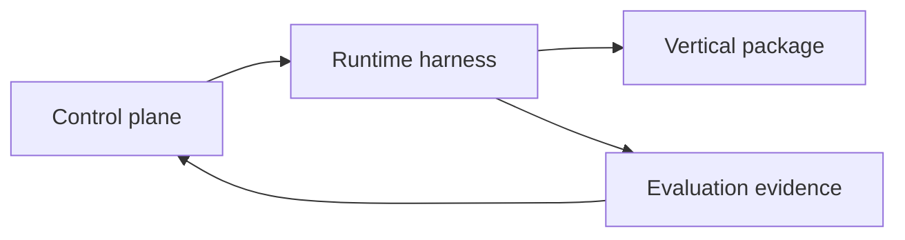

The harness determines how approved work runs safely and how evidence is captured. It does not decide what a domain answer should contain. [Read the authoritative source](https://github.com/rian010194/cortxt/blob/main/docs/architecture/runtime-and-evaluation-harness.md).

## Dependency direction

The runtime owns sandbox policy, writable scope, provider routing supplied by policy, limits, cancellation, temporary credentials, artifact capture, cleanup, and run-state reporting.

Evaluation distinguishes deterministic structural assertions, probabilistic model-assisted grading with model identity, and human approval as a separate final gate.

Every run receives one explicitly approved workspace. Real customer material stays outside Git history, and the harness records exact writable scope before execution.
