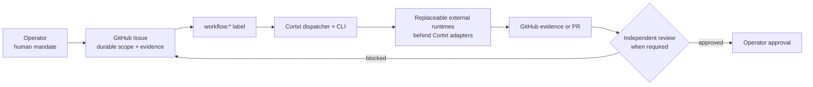

This page summarizes the active operational baseline reconciled on 2026-08-21. [Read the authoritative source](https://github.com/rian010194/cortxt/blob/main/docs/agents/current-operating-model.md).

## Verified path today

GitHub Issues are the durable source of truth for scope, evidence, review, and approval. Issue labels carry workflow state. Runtime task lists are execution ledgers, not independent backlogs.

## Product boundaries

- The `cortxt` CLI is the primary product surface.
- `cortxt mcp serve` is the external integration surface.
- Hermes, Pi, Codex, DSH, and other runtimes are replaceable execution resources behind Cortxt-owned adapters.
- The legacy web prototype was removed from the repository before the first public release (issue #225); the CLI remains the product surface.
- Only the human operator approves scope, irreversible effects, merge, publication, deploy, and final completion.

## Verified capabilities

- Dispatcher claim/run identity and workflow-label transitions.
- Worker invocation adapters with injected subprocess boundaries.
- Daemon loop end-to-end proof of life.
- A read-only MCP tool slice with tier flags.
- Provider-neutral inference through `InferencePort`.
- A deterministic provider-assurance policy gate that fails closed on malformed evidence.

## Current limits

The full unattended issue-to-result workflow is not yet the default, and operator approval remains the final gate. A successful experiment or smoke test must not be described as a finished production workflow.
