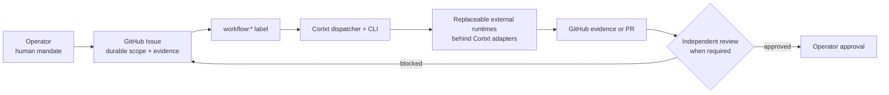

This page is a hand-maintained summary of the repository's operating model, reconciled on 2026-09-10. It describes supported work paths and their limits, not end-to-end readiness. [Read the authoritative source](https://github.com/rian010194/cortxt/blob/main/docs/agents/current-operating-model.md) -- where the two disagree, the repository wins.

## The supported path today

GitHub Issues are the durable source of truth for scope, evidence, review, and approval. Issue labels carry workflow state. Runtime task lists are execution ledgers, not independent backlogs.

## Product boundaries

Per ADR-042 (accepted 2026-08-26) and ADR-044 (accepted 2026-08-28), Cortxt
is work- and mandate-first: the durable Workstream and its authorized outcome
are the product, not any one interface. Three interfaces expose that
authority:

- **Cortxt OS** is the accepted general shell and first-party app runtime.
  **Work** is its first principal app (app ID `work`, route `/work`), not
  the identity of the OS. Both are in active development — not yet a
  finished product.
- The **`cortxt` CLI** remains the local, automation, bootstrap, diagnostic,
  and power-user interface, and today is the most complete verified one.
- **`cortxt mcp serve`** remains the external, mandate-protected integration
  surface.

Hermes, Pi, Codex, DSH, and other runtimes are replaceable execution
resources behind Cortxt-owned adapters — keep the Workstream, replace the
Run. The legacy web prototype was removed from the repository before the
first public release (issue #225); Work Console is retired by ADR-044 with a
bounded compatibility migration to Work, and Workspace keeps its
execution-resource meaning (the optional Git branch/worktree attached to a
Workstream). Only the human operator approves scope, irreversible effects,
merge, publication, deploy, and final completion.

## What existing evidence establishes

Code that exists, a controlled verification, real runtime evidence and routine
daily use are four different things. None implies the others.

- Dispatcher claim/run identity and workflow-label transitions.
- Worker invocation adapters with injected subprocess boundaries.
- Daemon loop end-to-end proof of life.
- A read-only MCP tool slice with tier flags.
- Provider-neutral inference through `InferencePort`.
- A deterministic provider-assurance policy gate that fails closed on malformed evidence.

## Current limits

These are exercised under controlled conditions -- fake runtimes, synthetic
fixtures and recorded experiments -- which is not the same as live proof. The
full unattended issue-to-result workflow is not the default, and operator
approval remains the final gate.

A successful experiment or smoke test is not a finished production workflow.
Neither is merged UI work, a registered adapter, a passing fixture, or requested
model metadata: none of those establishes verified end-to-end capability.
Unknown usage or cost stays unknown, never zero.
