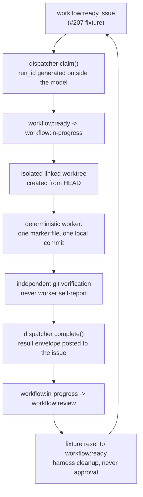

The mechanical dispatch loop is proven end-to-end against the live
repository: an approved `workflow:ready` issue is claimed, a deterministic
worker commits to an isolated worktree, a result envelope lands on the
issue, and the label sequence `workflow:ready -> workflow:in-progress ->
workflow:review` is observed -- then the fixture is reset. No model
inference is involved; the proof exercises the production claim/run
identity, label transitions, and result envelope through the real
dispatcher.

## The loop

## Public evidence

The proof fixture is [issue #207](https://github.com/rian010194/cortxt/issues/207),
labeled `workflow:ready` + `background-task` + `ci:dispatch-proof`. Each
green run leaves a claim comment, a result comment, and a reset comment on
that issue.

| Date | Actions run | Routed engine | Result |
| --- | --- | --- | --- |
| 2026-08-22 (inaugural) | [run 32557664882](https://github.com/rian010194/cortxt/actions/runs/32557664882) | `dsh` | success -- commit landed |
| 2026-08-22 (after hermes-free joined the manifest) | [run 32604071869](https://github.com/rian010194/cortxt/actions/runs/32604071869) | `hermes-free` | success -- commit landed |

The routing assertion is deterministic but not pinned to one engine: the
proof follows whatever engine `route(["background-task"])` selects from
the production manifest (cheapest `cost_class`, deterministic `engine_id`
tie-break). When the free-tier `hermes-free` entry joined the manifest,
the proof tracked the route instead of failing -- see
[PR #279](https://github.com/rian010194/cortxt/pull/279).

The result envelope is complete and correlated: `issue_id`, `run_id`,
`runtime` (`ci-deterministic/<engine>-route-v1`), `worker_role`, timestamps,
`model` (`none`), `cost` (exact zero, no inference), `artifacts`
(content-free marker path + commit hash + sha256), `evidence` (route,
worktree, commit verification), and `error` (`null`).

## What this proves (and what it does not)

Proven:

- Claim/run identity is real: the dispatcher generates `run_id` outside
  the model and transitions labels against the live repository.
- A landed commit in an isolated worktree is verified independently of the
  worker's self-report.
- The result envelope is posted to the issue by the dispatcher.
- The label sequence is exactly `ready -> in-progress -> review`, and the
  fixture is reset administratively (never by the worker).

Not yet proven (the next step toward unattended production dispatch):

- A *model-backed* worker running a real build issue end-to-end through
  the default path (the current default dispatch path for real build
  issues is not yet exercised unattended; operator approval remains the
  final gate).
- Provider-failure recovery across restarts (the deterministic proof has
  no provider to fail).

See the [dispatch contract](../dispatch-contract/) for the full contract
this loop satisfies, and [current operating model](../operating-model/)
for what is verified today.
